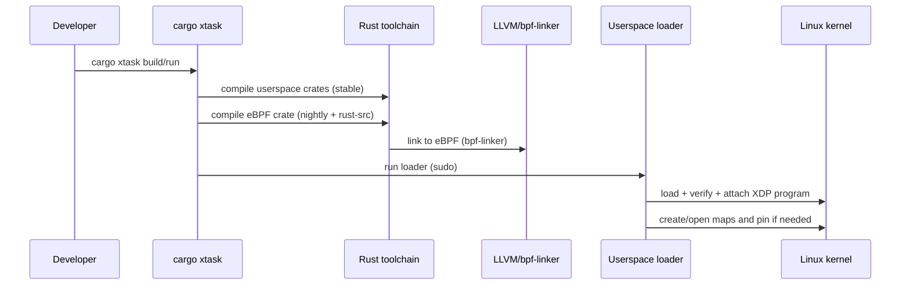

# rustedbytes-ebpf

A Rust + Aya template project for building and running an eBPF program (XDP) with a user-space loader.

## Technical overview

This repository is structured as a multi-crate Rust workspace that builds:

- **An eBPF program** (kernel space) compiled to eBPF bytecode and attached at the **XDP** hook.
- **A user-space loader** responsible for loading, verifying, and attaching the program, and for interacting with **BPF maps**.
- **A common crate** that contains types shared between user space and kernel space.

### Architecture

```mermaid
flowchart LR
  subgraph Userspace
    L[rustedbytes-ebpf<br/>(loader)]
  end

  subgraph Kernel
    X[rustedbytes-ebpf-ebpf<br/>(XDP program)]
    M[(BPF Maps)]
  end

  NIC[Network interface] -->|Packets| X
  X -->|Pass / Drop / Redirect| NIC

  L <--> |map fds / updates / reads| M
  L -->|load + attach| X
```

### Build pipeline

The project uses **Aya** to build and load eBPF code from Rust. In practice, the flow is:



## Project structure

```text
rustedbytes-ebpf/           Main project (user-space loader)
rustedbytes-ebpf-ebpf/      eBPF program (kernel space, XDP)
rustedbytes-ebpf-common/    Types shared between kernel and userspace
xtask/                      Build/run helpers (cargo xtask)
test-env/                   Virtualized test environment (Vagrant)
```

## Requirements

1. **Rust stable**: `rustup toolchain install stable`
2. **Rust nightly** (for eBPF compilation): `rustup toolchain install nightly --component rust-src`
3. **bpf-linker**: `cargo install bpf-linker`
4. **Vagrant** (for VM-based tests): https://www.vagrantup.com/downloads
5. **VirtualBox** (VM provider): https://www.virtualbox.org/

> Notes
> - Running the loader requires a recent Linux kernel with eBPF enabled and root privileges (or the appropriate capabilities).

## Build

```sh
# Build both the eBPF program and the user-space loader
cargo build --package rustedbytes-ebpf

# Or via xtask
cargo xtask build

# Release build
cargo xtask build --release
```

## Run

Root privileges are required to load and attach an eBPF program:

```sh
# Run on eth0 (default)
cargo xtask run

# Or specify the interface
cargo xtask run --iface lo

# Directly with cargo (requires sudo)
sudo -E cargo run --release -- --iface eth0
```

## Testing in a virtual environment

The project includes a Vagrant-based test environment to run the module inside an isolated VM.

```sh
# Boot the VM and run tests automatically
cargo xtask test-vm

# Or run the script directly
cd test-env
./run-tests.sh

# SSH into the VM manually
cd test-env
vagrant up
vagrant ssh
```

## Cross-compilation (macOS)

```sh
CC=${ARCH}-linux-musl-gcc cargo build --package rustedbytes-ebpf --release \
  --target=${ARCH}-unknown-linux-musl \
  --config=target.${ARCH}-unknown-linux-musl.linker="${ARCH}-linux-musl-gcc"
```

## License

Except for the eBPF code, rustedbytes-ebpf is distributed under the terms of the **MIT license** or the **Apache License (Version 2.0)**, at your option.

The eBPF code is distributed under the terms of the **GNU General Public License, Version 2** or the **MIT license**, at your option.

[Apache License]: LICENSE-APACHE
[MIT license]: LICENSE-MIT
[GNU General Public License, Version 2]: LICENSE-GPL2
